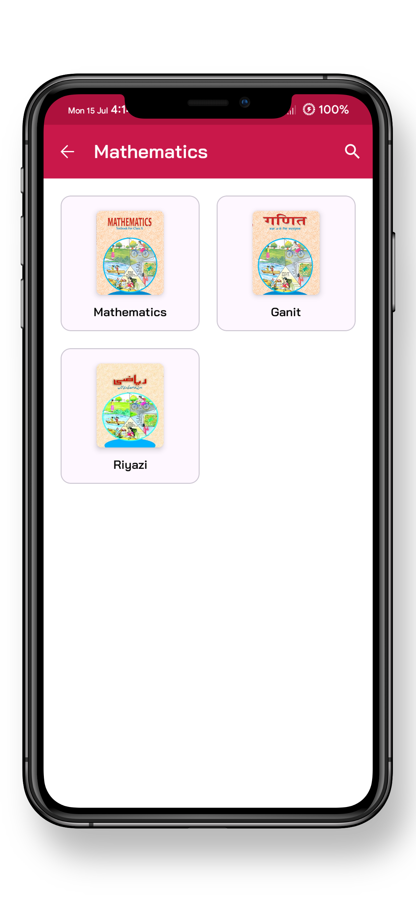
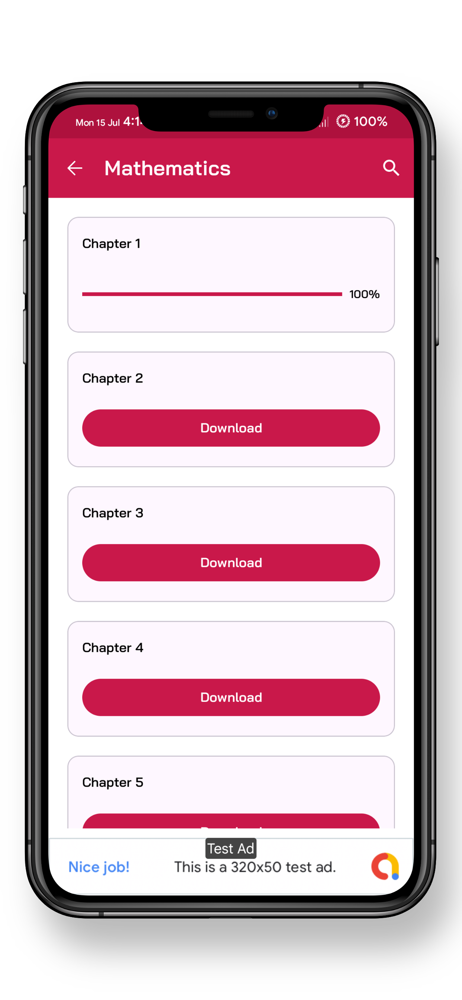
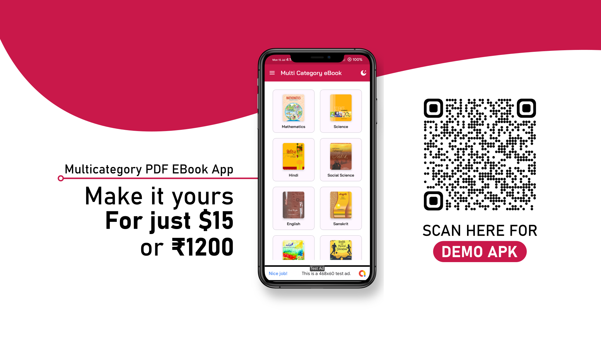

# Multi-Category PDF eBook App

<p style="font-size: 20px; font-weight: bold;">
  <span style="animation: blinker 1.5s linear infinite;">📚 TRY US, BEFORE YOU BUY</span>. 
</p>

<style>
@keyframes blinker {
  50% {
    opacity: 0;
  }
}
</style>


## Screenshots

### Mobile App Screenshots

<div style="display: flex; flex-wrap: wrap; gap: 10px;">
  
  
  
  
  
  
  
</div>

# 📚 Multi-Category PDF eBook App with JSON Backend

🚀 **Unlimited Categories & Subcategories**: Easily add and manage an unlimited number of categories and subcategories for your eBooks.

🌗 **Dark/Light Theme**: Switch between dark and light themes for a comfortable reading experience day and night.

💸 **Multiple Ad Networks**: Monetize your app with support for various ad networks, including:
- AdMob 🟢
- Google Ad Manager 🔵
- FAN (Facebook Audience Network) 🔷
- StartApp 🚀
- Unity 📲
- AppLovin Max & Discovery 🎯
- IronSource 🔑
- Wortise 💼
- Alien Ads 👽

📈 **Ad Formats**: Maximize revenue with multiple ad formats:
- Banner Ads 🖼️
- Interstitial Ads 📲
- App Open Ads 🚪

⚡ **Fast & Responsive**: Enjoy a smooth and responsive user interface, ensuring a seamless reading experience.

🔄 **JSON Backend**: Easily manage and update your eBook categories and content using a flexible JSON backend.

# Json Setup

```json
{
    "categories": [
        {
            "category_title": "Mathematics",
            "category_image": "https://ncert.nic.in/textbook/pdf/jemh1cc.jpg",
            "subcategories": [
                {
                    "subcategory_title": "Mathematics",
                    "subcategory_image": "https://ncert.nic.in/textbook/pdf/jemh1cc.jpg",
                    "items": [
                        {
                            "item_title": "Chapter 1",
                            "item_url": "https://ncert.nic.in/textbook/pdf/jemh101.pdf"
                        },
                        {
                            "item_title": "Chapter 2",
                            "item_url": "https://ncert.nic.in/textbook/pdf/jemh102.pdf"
                        },
                        {
                            "item_title": "Chapter 3",
                            "item_url": "https://ncert.nic.in/textbook/pdf/jemh103.pdf"
                        },
                        {
                            "item_title": "Chapter 4",
                            "item_url": "https://ncert.nic.in/textbook/pdf/jemh104.pdf"
                        }
                    ]
                }
            ]
        }
    ]
}
```

📲 **User-Friendly Design**: Modern and intuitive design to enhance user engagement and satisfaction.

# DEMO Video

This is the demo video link

[Watch the video on YouTube](https://youtu.be/TthQPvanXxE)

## Download

<a href="https://github.com/xposed73/Multi-Category-Pdf-eBook-App-with-JSON-Backend/releases/download/1.0.0/universal-release-null-1.0.0.apk">
  
</a>

## Download Demo Via QR

<a>
  
  
</a>

