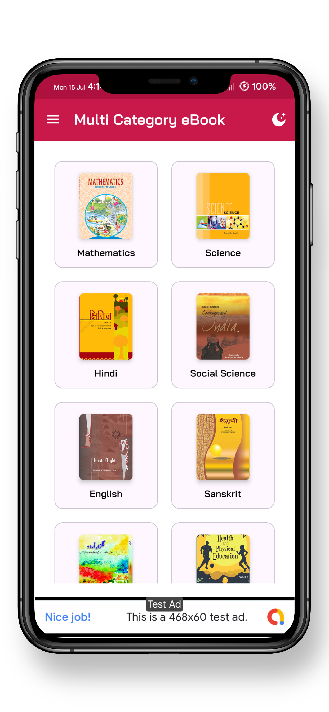
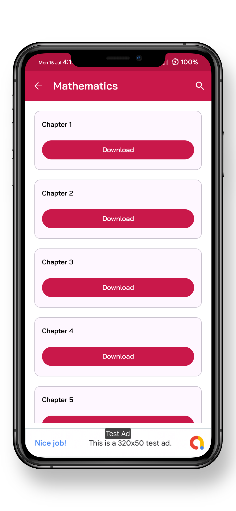
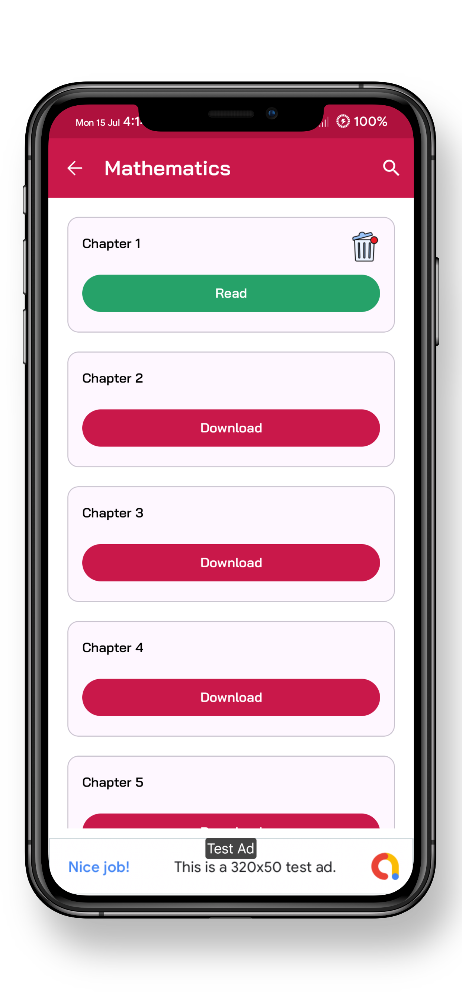
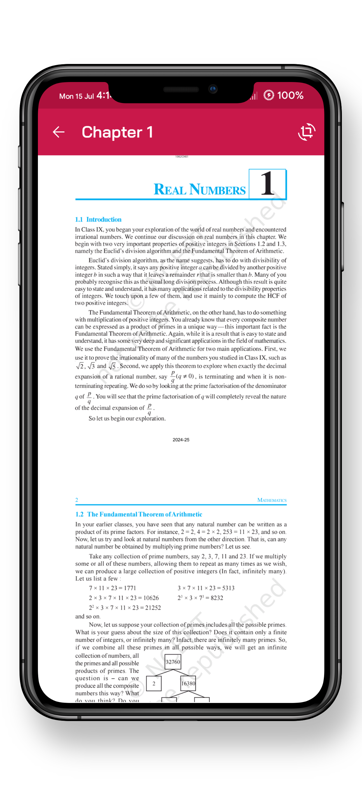

## Screenshots

### Mobile App Screenshots

  
  
  
  
  
  
  

# 📚 Multi-Category PDF eBook App with JSON Backend

🚀 **Unlimited Categories & Subcategories**: Easily add and manage an unlimited number of categories and subcategories for your eBooks.

🌗 **Dark/Light Theme**: Switch between dark and light themes for a comfortable reading experience day and night.

💸 **Multiple Ad Networks**: Monetize your app with support for various ad networks, including:
- AdMob 🟢
- Google Ad Manager 🔵
- FAN (Facebook Audience Network) 🔷
- StartApp 🚀
- Unity 📲
- AppLovin Max & Discovery 🎯
- IronSource 🔑
- Wortise 💼
- Alien Ads 👽

📈 **Ad Formats**: Maximize revenue with multiple ad formats:
- Banner Ads 🖼️
- Interstitial Ads 📲
- App Open Ads 🚪

⚡ **Fast & Responsive**: Enjoy a smooth and responsive user interface, ensuring a seamless reading experience.

🔄 **JSON Backend**: Easily manage and update your eBook categories and content using a flexible JSON backend.

📲 **User-Friendly Design**: Modern and intuitive design to enhance user engagement and satisfaction.

# DEMO Video

This is the demo video link

[Watch the video on YouTube](https://youtu.be/TthQPvanXxE)

